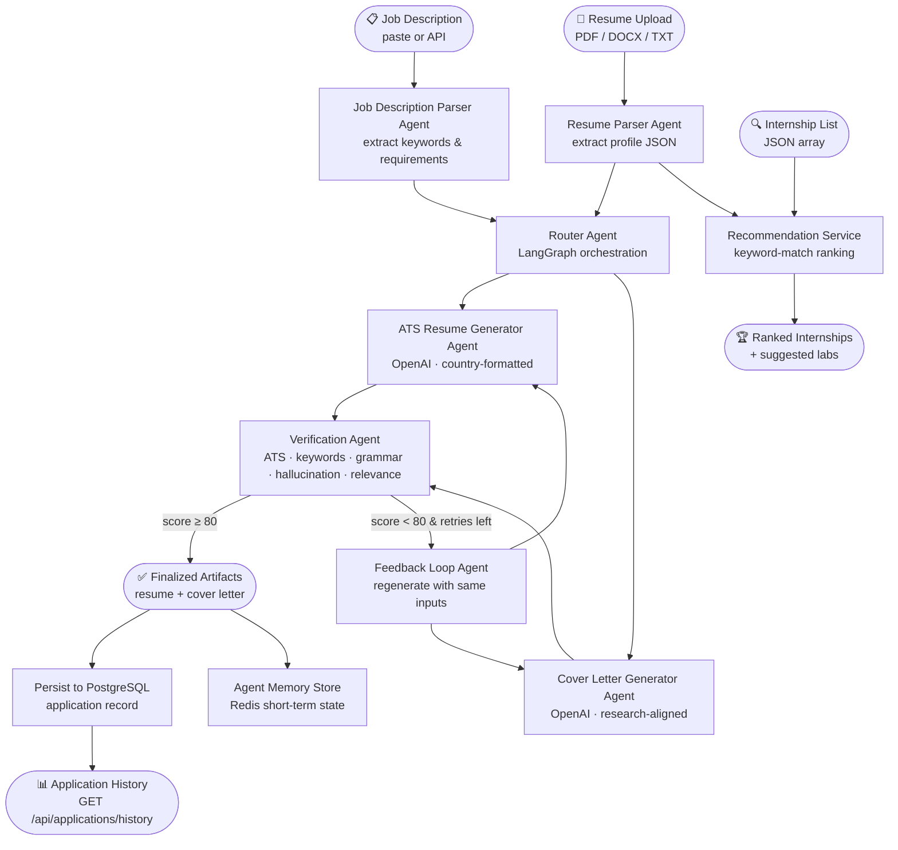

# Multi-Agent AI Internship Application System

Production-oriented platform to automate global research internship applications using a modular multi-agent architecture.

---

## 🗺️ Workflow Diagram



---

## 🚀 Overview

This project automates global research internship applications with a 7-agent AI pipeline. Each agent handles a distinct stage: from parsing your resume and a job description, through tailored document generation, automated quality verification with a retry loop, to persistence and analytics.

---

## ⚙️ How It Works — Step-by-Step Walkthrough

### Step 1 – Upload Your Resume

POST your PDF, DOCX, or plain-text resume to `/api/resume/upload`.

```bash
curl -X POST http://localhost:8000/api/resume/upload \
  -F "file=@resume.pdf"
```

**What happens inside:**
- `ResumeParserAgent` reads the file bytes. For PDFs it uses PyMuPDF; for DOCX it uses `python-docx`; for scanned PDFs it falls back to Tesseract OCR.
- Sections are matched by keyword hints (education, experience, projects, certifications, research interests).
- A `ResumeProfile` JSON is stored in PostgreSQL and cached in Redis.

**Sample output:**
```json
{
  "candidate_id": 42,
  "profile": {
    "name": "Jane Doe",
    "email": "jane@example.com",
    "skills": ["docker", "fastapi", "nlp", "python", "pytorch"],
    "education": ["M.Sc. Computer Science, TU Berlin, 2024"],
    "projects": ["LLM-based document summarizer (PyTorch, LangChain)"],
    "experience": ["Research Assistant – NLP Lab, 2023-2024"],
    "research_interests": ["NLP", "LLM fine-tuning", "information extraction"],
    "certifications": []
  }
}
```

---

### Step 2 – Parse the Job Description

POST the raw job description text to `/api/job/parse`.

```bash
curl -X POST http://localhost:8000/api/job/parse \
  -H "Content-Type: application/json" \
  -d '{"job_description": "We seek an intern with Python, PyTorch, NLP experience to work on LLM research..."}'
```

**What happens inside:**
- `JobDescriptionParserAgent` tokenises the text and extracts up to 40 keywords.
- Lines containing "required / must / qualification / eligibility" are collected as required skills.
- Known technology names (python, pytorch, docker, …) and research domains (nlp, vision, robotics, …) are identified.

**Sample output:**
```json
{
  "keywords": ["experience", "fine-tuning", "intern", "language", "llm", "nlp", "python", "pytorch", "research"],
  "required_skills": ["Must have Python and PyTorch experience"],
  "technologies": ["python", "pytorch"],
  "research_domains": ["llm", "nlp"],
  "responsibilities": ["Research on large language model fine-tuning"],
  "eligibility_requirements": ["Must have Python and PyTorch experience"]
}
```

---

### Step 3 – Run the Full Application Workflow

POST to `/api/applications/run` to trigger the complete pipeline.

```bash
curl -X POST http://localhost:8000/api/applications/run \
  -H "Content-Type: application/json" \
  -d '{
    "candidate_id": 42,
    "job_description": "We seek an intern with Python, PyTorch, NLP experience...",
    "country": "germany"
  }'
```

**What happens inside (Router Agent / LangGraph):**

| Step | Agent | Action |
|------|-------|--------|
| 1 | `ATSResumeGeneratorAgent` | Calls OpenAI to produce a country-formatted, ATS-safe resume |
| 2 | `CoverLetterGeneratorAgent` | Calls OpenAI to write a research-aligned cover letter |
| 3 | `VerificationAgent` | Scores both documents on 5 dimensions (see below) |
| 4 | `FeedbackLoopAgent` | If score < 80, regenerates; retries up to 2 times |
| 5 | Persist | Saves application record and artifacts to PostgreSQL |

**Country formatting rules applied by the ATS Resume Generator:**

| Country | Rule applied |
|---------|--------------|
| `usa` | One-page, impact bullets, measurable outcomes |
| `germany` | Structured chronology with technical depth |
| `uk` | Achievement-focused bullets, concise project context |
| `canada` | Clear section headers, skills matrix |
| `europe` | Europass-compatible ordering |
| `global` *(default)* | ATS-safe plain text, role-specific keywords |

**Sample output:**
```json
{
  "application_id": 7,
  "resume": "Jane Doe | jane@example.com\n\nSummary\nNLP researcher with Python and PyTorch expertise...",
  "cover_letter": "Dear Hiring Committee,\n\nI am excited to apply for the LLM Research Internship...",
  "verification": {
    "score": 84.5,
    "ats_score": 77.65,
    "keyword_coverage": 66.67,
    "grammar_score": 90.0,
    "hallucination_risk": 10.0,
    "relevance_score": 72.16,
    "issues": []
  }
}
```

---

### Step 4 – View Application History

```bash
curl http://localhost:8000/api/applications/history
```

Returns all past applications ordered by creation date, including their verification scores.

---

### Step 5 – Get Internship Recommendations

```bash
curl -X POST http://localhost:8000/api/recommendations \
  -H "Content-Type: application/json" \
  -d '{
    "profile": { "skills": ["python", "nlp"], "research_interests": ["llm"], ... },
    "internships": [
      {"title": "NLP Research Intern", "description": "Work on LLMs with Python", "keywords": ["nlp", "python", "llm"]},
      {"title": "Computer Vision Intern", "description": "Object detection research", "keywords": ["vision", "pytorch"]}
    ]
  }'
```

The `InternshipRecommendationService` scores each listing by how many of your profile keywords appear in the title, description, and keyword fields, normalised to 0–100.

---

## 🧩 Agent Reference

| Agent | Input | Output | Key Logic |
|-------|-------|--------|-----------|
| **Resume Parser** | PDF / DOCX / TXT bytes | `ResumeProfile` JSON | PyMuPDF text extraction; OCR fallback via Tesseract; section detection by keyword hints |
| **Job Description Parser** | Raw JD string | `JobDescriptionData` JSON | Regex tokenisation; keyword deduplication (top 40); technology & domain classification |
| **ATS Resume Generator** | `ResumeProfile` + `JobDescriptionData` + country | Plain-text resume string | OpenAI prompt with country formatting rule; no fabrication of skills |
| **Cover Letter Generator** | `ResumeProfile` + `JobDescriptionData` + country | Plain-text cover letter string | OpenAI prompt focused on research alignment and technical fit |
| **Verification Agent** | resume + cover letter + `JobDescriptionData` | `VerificationResult` (score 0–100) | Keyword coverage, ATS heuristic, grammar proxy (word count), hallucination marker check, relevance composite |
| **Feedback Loop Agent** | All generation inputs + verification result | Best resume + cover letter + final `VerificationResult` | Retries generation up to `max_retries` (default: 2) while `score < 80` |
| **Router Agent** | `ResumeProfile` + `JobDescriptionData` + country | Final `WorkflowState` | LangGraph `StateGraph` with `generate → verify → improve` conditional edges |

### Verification Score Breakdown

The `VerificationAgent` computes a composite score (0–100) from five dimensions:

| Dimension | Formula |
|-----------|---------|
| `ats_score` | `min(100, 55 + keyword_coverage × 0.45)` |
| `keyword_coverage` | `matched_keywords / total_job_keywords × 100` |
| `grammar_score` | 90 if resume > 100 words and cover letter > 80 words, else 75 |
| `hallucination_risk` | 10 (clean) or 50 (if "lorem" placeholder detected) |
| `relevance_score` | `(keyword_coverage + ats_score) / 2` |
| **`score`** | `(ats_score + keyword_coverage + grammar_score + (100 − hallucination_risk) + relevance_score) / 5` |

Issues are flagged when `keyword_coverage < 60`, `grammar_score < 80`, or `hallucination_risk > 20`.

---

## 🛠️ Quick Start

```bash
# Copy environment templates
cp backend/.env.example backend/.env
cp frontend/.env.example frontend/.env

# Start all services (backend, frontend, PostgreSQL, Redis)
docker compose up --build
```

- Backend API docs (Swagger UI): http://localhost:8000/docs
- Frontend dashboard: http://localhost:3000

---

## 🖥️ Local Development

```bash
# Backend
cd backend
pip install -r requirements.txt
uvicorn app.main:app --reload

# Frontend
cd frontend
npm install
npm run dev
```

---

## 🧪 Testing

```bash
cd backend
pytest -q
```

---

## 📐 Stack

| Layer | Technology |
|-------|-----------|
| Backend API | FastAPI, Pydantic v2 |
| LLM Orchestration | LangGraph, OpenAI API |
| Document Parsing | PyMuPDF, python-docx, Tesseract OCR |
| Database | PostgreSQL (SQLAlchemy) |
| Cache / State | Redis |
| Frontend | Next.js, TailwindCSS, Axios |
| Infrastructure | Docker, docker-compose, GitHub Actions CI |

---

## 📂 Repository Layout

```
internship-ai-system/
├── backend/
│   └── app/
│       ├── agents/          # 7 agent implementations
│       ├── routes/          # FastAPI route handlers
│       ├── models/schemas.py# Pydantic request/response models
│       ├── services/        # OpenAI, memory, ranking, recommendation
│       └── utils/           # Text helpers, country formatting rules
├── frontend/
│   └── src/app/             # Next.js pages: upload, results, history, settings, dashboard
├── docs/
│   ├── architecture.md
│   ├── workflow.md
│   └── skill.md
└── docker-compose.yml
```

---

## 📚 Documentation

- Architecture details: [`/docs/architecture.md`](docs/architecture.md)
- Workflow reference: [`/docs/workflow.md`](docs/workflow.md)
- Agent skill instructions: [`/docs/skill.md`](docs/skill.md)

---

## 🤝 Contributing

Open issues and pull requests are welcome. Please describe the agent or route affected and include test coverage for backend changes.

---

## 📄 License

MIT © 2026 [Hemant Choudhary](https://github.com/CHHemant)
